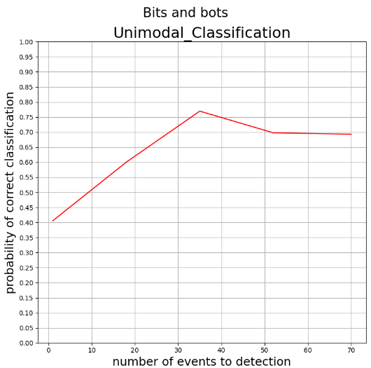

[ISIT bit and bots](https://www.kaggle.com/competitions/isit-2024-bits-and-bots)

```sh
python main.py
```



請至  
https://drive.google.com/drive/folders/1EjChu2YCCPZOqnkq5zNPnC4V3THaJ_9g  
下載 data 資料夾      
然後丟到這個資料夾裡面      


你的檔案看起來應該要像是這樣   

```
data/  
nets/  
main.py   
main_gen.py   
```   

#### how to run  

第一題  defense   
```sh  
python main.py
```

第二題  offense   
需要跑過第一題， 產生過model.ckpt 之後才可以跑第二題    
```sh
python main_gen.py
```
